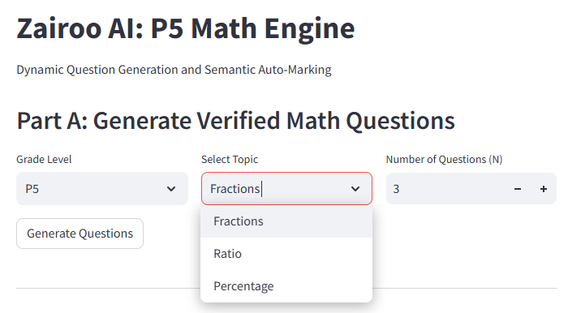
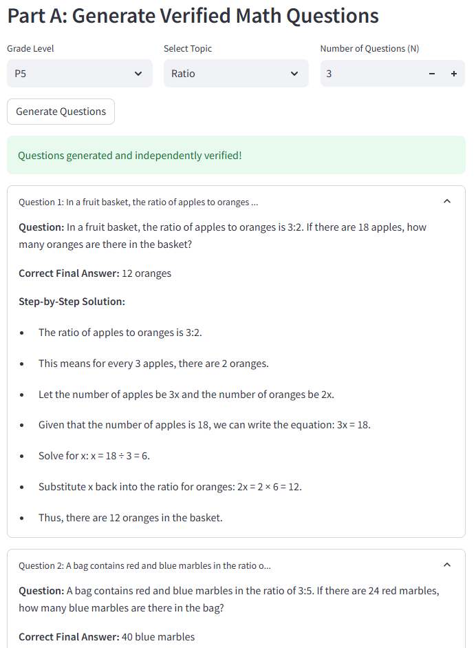
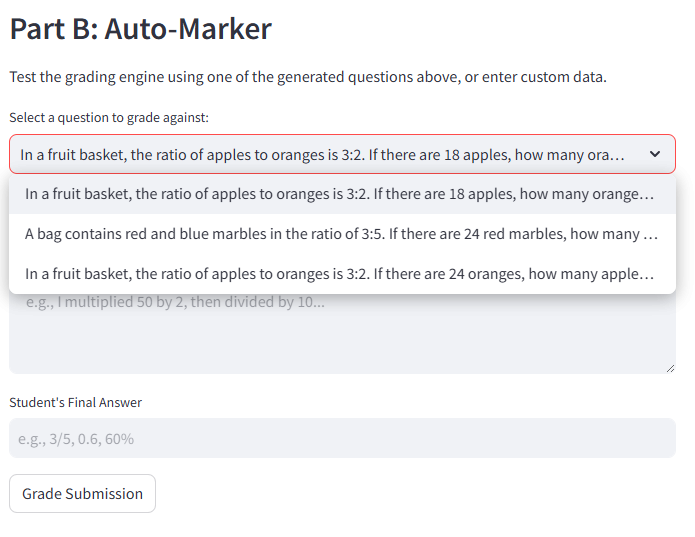
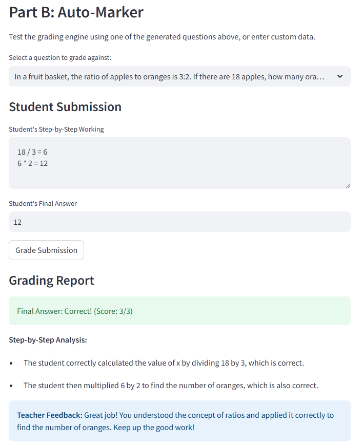
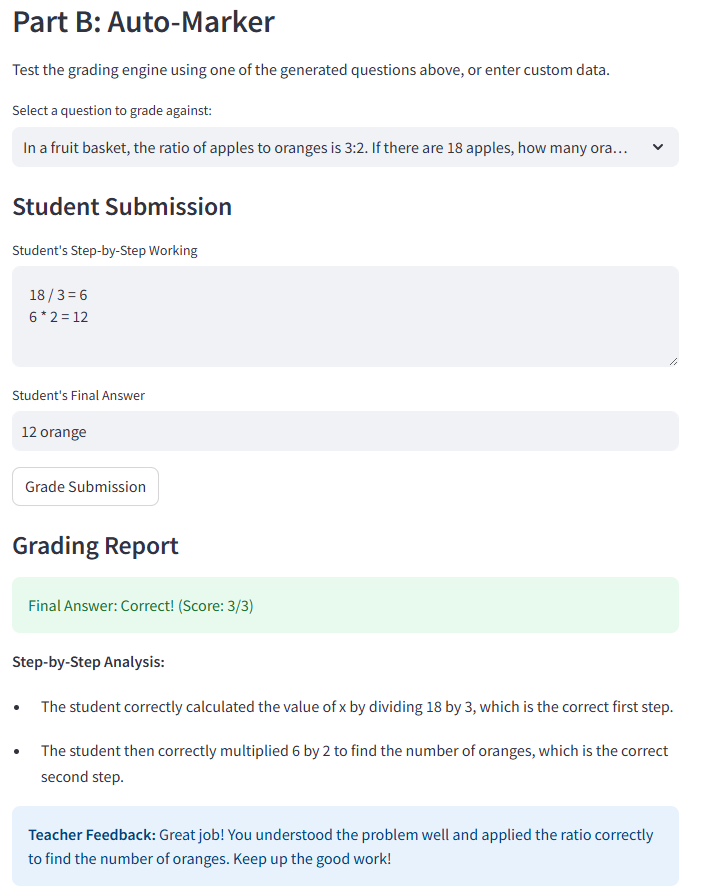
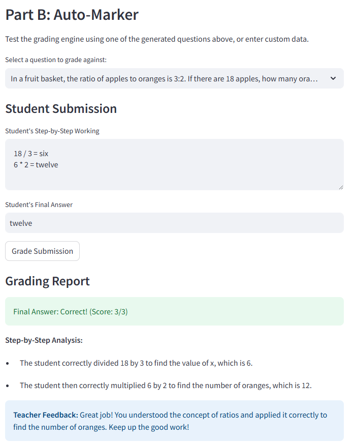
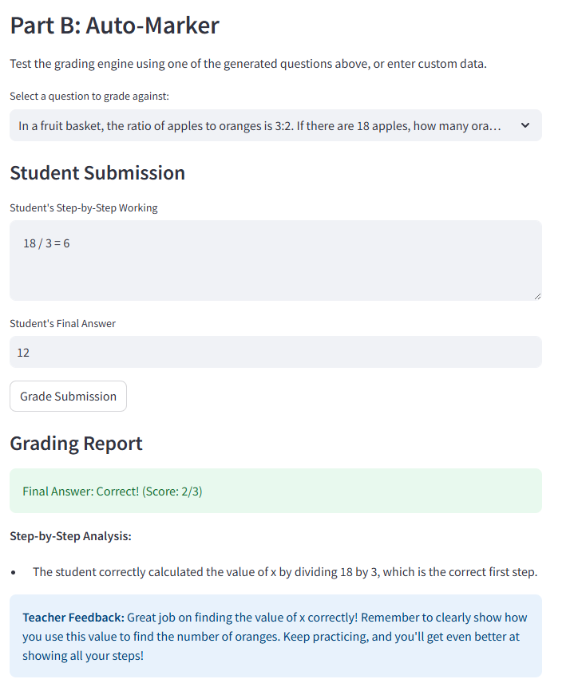
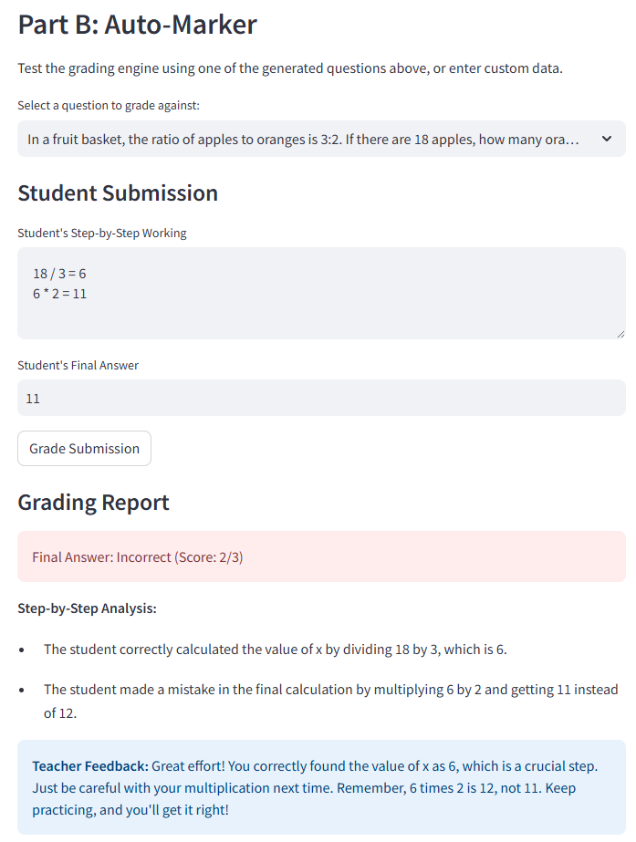

# Zairoo AI

## Overview
This repository contains a full-stack, minimal web application built with Python and Streamlit, designed to solve the two core pain points in AI-driven primary education: LLM mathematical hallucinations and semantic grading variations. 

## Core Design Decisions & Trade-offs

### 1. Why I chose this architecture
* **Architecture Choice**
  * **Framework:** I chose Streamlit for the frontend and standard Python for the backend logic. 
  * **Why:** Streamlit allows for rapid UI prototyping without writing React/HTML, ensuring that the engineering focus is spent entirely on the LLM orchestration, architecture, and prompt engineering. The backend logic (`ai_core.py`) is modular and can be instantly ported to a FastAPI or Flask backend for production.

### 2. Why I call the LLM this way
* **LLM Integration via Vercel AI Gateway**
  * I utilized the `openai` Python SDK but routed the `base_url` through the Vercel AI Gateway. 
  * **Why:** This provides seamless compatibility with OpenAI’s `gpt-4o` models while leveraging Vercel's edge caching, rate limiting, and observability. I utilized **Structured Outputs (Pydantic)** to force the LLM to return strictly typed JSON. This eliminates parsing errors and ensures the UI always receives structured arrays for step-by-step logic.

### 3. How I ensure math question correctness
* **Solving Pain Point 1: Ensuring Math Question Correctness**
  * **The Problem:** LLMs are linguistic engines, not calculators. They frequently generate a question text with conditions that contradict the final arithmetic.
  * **The Solution (Generator-Validator Agent Loop):** I opted for added complexity here to ensure absolute reliability. The system employs a two-pass Agentic architecture:
    1. **The Generator Agent:** Creates the question, steps, and final answer.
    2. **The Validator Agent:** An independent prompt running at `temperature=0.0`. It acts as a strict auditor, given *only* the question text and asked to re-calculate the math from scratch. 
    3. **The Loop:** If the Validator finds a discrepancy between the Generator's math and its own, the system rejects the problem and triggers a regeneration. 
  * **Trade-off:** This costs twice as many API calls per question, slightly increasing latency. However, in an educational platform where a wrong question severely impacts a child's learning trust, trading slight latency for mathematical guarantee is a necessary architectural choice.

### 4. Why the marker uses this particular parsing approach
* **Solving Pain Point 2: The Auto-Marker Parsing Approach**
  * **The Problem:** Regex or strict string-matching fails instantly on variations like `3/5`, `0.6`, `60%`, and `six tenths`. 
  * **The Solution (Semantic Grading):** Instead of writing complex normalizer functions in Python, I passed the grading logic back to the LLM via a highly contextualized prompt. The LLM is provided the original question, the known-correct steps, the student's working, and the student's final answer.
  * **Why this works:** LLMs possess deep semantic mapping capabilities. It intrinsically knows that `0.6` and `3/5` are equivalent representations of the same vector space. Furthermore, by passing the *working steps*, the prompt is instructed to award partial marks based on intermediate mathematical logic, mimicking a real MOE Primary school teacher's rubric.

### 5. Where I opted for simplicity 
* State management and UI. I used basic Streamlit session states rather than standing up a vector database (like ChromaDB) or a relational database, as persistence was not required for this proof of concept.

### 6. Where I added complexity for reliability
* Prompt engineering and strict Pydantic schemas. Implementing the retry-loop for math validation adds backend complexity but guarantees a zero-hallucination rate for the user-facing output.

## How to Install and Run (Conda Environment)

This project uses Conda for environment management to ensure clean dependency isolation.

**1. Create the Conda environment from the configuration file:**
```bash
conda env create -f environment.yml
```

**2. Activate the environment:**
```bash
conda activate zairoo_ai
```

**3. Configure your API Keys:**

Create a .env file in the root directory and add the provided Vercel AI Gateway credentials:
```bash
VERCEL_GATEWAY_URL="https://ai-gateway.vercel.sh/v1"
VERCEL_API_KEY="API Key Here"
```

**4. Run the Application:**

```bash
streamlit run app.py
```

## App Demo



*   Zairoo AI allows user to select the **Grade Level**, **Topic** and **Number of Questions**

---



*   Once user click on **Generate Questions**, Zairoo AI will generate questions base on the selected options.

---



*   Zairoo AI allows user to select the questions generated previously for auto marking.

---



*   Zairoo AI allows user to input the **Student's Step-by-Step Working** and **Student's Final Answer**
*   Once user click on **Grade Submission**, Zairoo AI will shows the **Step-by-Step Analysis** and **Teacher Feedback**
---



*   Zairoo AI is able to determine that **12 orange** is also the **correct answe**r.

---



*   Zairoo is able to perform auto marking if the student's answer is mix with **numbers and words**.
*   e.g. **six** and **twelve**

---



*   Zairoo AI can give partial grading if the **working** is incomplete, but **final answer** is **correct**.

---



*   Zairoo AI can give partial grading if the **working** and **final answer** is **partially correct**.

---

